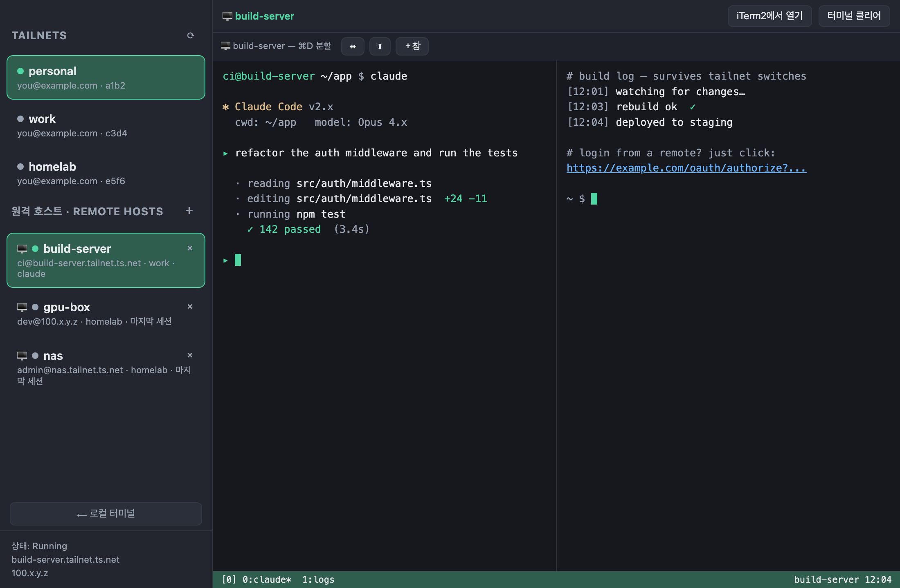

# tailscalemux

> Switch between multiple Tailscale accounts from one window, work in a built‑in
> tmux terminal, jump into per‑host **remote tmux** sessions over Tailscale SSH,
> and hand off to iTerm2 — all without losing your running work when the network
> changes.

A small macOS desktop app (Electron) for people who juggle several Tailscale
tailnets and machines and want it to feel like working locally.



*(English below · [한국어 설명은 아래로](#한국어))*

---

## English

### Why this exists

If you use more than one Tailscale account, switching between them (`tailscale
switch`) and then re‑opening terminals, re‑SSHing, and losing your place is
tedious. And if you run a long task (say, **Claude Code**) on a remote machine
over SSH, switching your local tailnet drops the connection — which would kill
the task if it weren't protected.

**tailscalemux** ties these together:

- One click switches the Tailscale profile **and** drops you into that machine's
  terminal.
- Remote work runs inside **tmux on the remote host**, so changing your local
  tailnet only drops the SSH transport — the remote session (and Claude Code, or
  whatever is running) keeps going. Click the host again to re‑attach exactly
  where you left off.

### Features

- **Tailnet switcher** — reads `tailscale switch --list`; click a tailnet to
  switch. Current profile, backend state, and Tailscale IP shown at a glance.
- **Built‑in terminal** — a real login shell via `node-pty` + `xterm.js`, run
  inside a local **tmux** session (persistent across app restarts).
- **Remote hosts** — register machines (each tied to its tailnet). Clicking one
  auto‑switches the tailnet, SSHes in, and attaches to that host's tmux session.
  Leave the session name blank to re‑attach to whatever you were last using.
- **Survives tailnet switches** — remote tmux keeps your work alive when the
  network changes; reconnect and it's all still there.
- **iTerm2 hand‑off** — open a new iTerm2 tab labelled with the current tailnet.
- **iTerm‑style splits** — `⌘D` / `⌘⇧D` to split, `⌘]`/`⌘[` to move between panes,
  `⌘T` for a new window — driven by tmux, so they work locally and remotely.
- **Click‑to‑open URLs** — long OAuth/login URLs are clickable (opens in your
  browser), plus `⌘C` / `⌘V` copy & paste that actually work with xterm.
- **UTF‑8 fixed** — forces a UTF‑8 locale so box‑drawing and non‑ASCII render
  correctly (a common breakage for Finder‑launched apps and bare SSH).

### Requirements

- macOS (Apple Silicon; the build script targets `arm64`)
- [Node.js](https://nodejs.org/) 18+ (developed on 22), Xcode Command Line Tools
  (`xcode-select --install`) for building `node-pty`
- [Tailscale](https://tailscale.com/) CLI — auto‑detected at `/usr/local/bin`,
  `/opt/homebrew/bin`, or inside `Tailscale.app`
- [tmux](https://github.com/tmux/tmux) — locally and on any remote host you
  connect to (`brew install tmux`, `sudo apt install -y tmux`, etc.)
- iTerm2 (only for the iTerm2 hand‑off button)

### Install & run

```bash
git clone https://github.com/devdynam0507/tailscalemux.git
cd tailscalemux
npm install          # rebuilds node-pty for Electron automatically
npm start            # run in dev
```

Build a `.app` and install it:

```bash
npm run package
ditto "dist/Tailscale Switcher-darwin-arm64/Tailscale Switcher.app" \
      "/Applications/Tailscale Switcher.app"
```

### Using remote hosts (recommended setup)

1. On each remote machine, enable Tailscale SSH (no key management needed):
   ```bash
   tailscale up --ssh
   ```
   and make sure `tmux` is installed.
2. In the app, under **원격 호스트 / Remote hosts**, click **＋** and add:
   - **Label** — e.g. `build-server`
   - **Target** — MagicDNS name or Tailscale IP (e.g. `build-server.tailXXXX.ts.net`)
   - **User** — the SSH login on that machine
   - **Session** — leave blank to re‑attach to your last tmux session
   - **Tailnet** — which profile to switch to before connecting
3. Click the host. It switches tailnet, SSHes in, and attaches to its tmux.

> Run your long‑lived work (e.g. `claude`) **inside the remote tmux**. Then a
> tailnet switch can't kill it — it's a process on the remote, owned by the
> remote tmux server.

### Keyboard shortcuts

| Shortcut | Action | tmux |
|---|---|---|
| `⌘D` | split left/right | `C-b %` |
| `⌘⇧D` | split top/bottom | `C-b "` |
| `⌘T` | new window (tab) | `C-b c` |
| `⌘W` | close pane | `C-b x` |
| `⌘]` / `⌘[` | next / previous pane | `C-b o` / `C-b ;` |
| `⌘⌥ ← ↑ ↓ →` | move to pane by direction | `C-b <arrow>` |
| `⌘⇧[` / `⌘⇧]` | previous / next window | `C-b p` / `C-b n` |
| `⌘1`–`⌘9` | select window N | `C-b N` |
| `⌘C` / `⌘V` | copy selection / paste | — |

Assumes the default tmux prefix (`C-b`). Hold `⌥` to select text when a TUI has
grabbed the mouse.

### How persistence works

```
[tailnet: work]  click host → ssh → Claude Code running inside remote tmux
      │  switch to tailnet "personal" (or open another host)
      ▼
   SSH drops (the pane shows "disconnected") — but the remote tmux session
   and everything in it keeps running on that machine
      │  click the original host again
      ▼
   re‑attach → right back where you were, nothing lost
```

### Security & privacy

- No credentials are stored in the repo. Your host list lives only in
  `~/Library/Application Support/tailscale-switcher/hosts.json` on your machine
  and is never committed.
- Passwords are never written to disk — password‑auth hosts prompt in the
  terminal. Prefer Tailscale SSH to avoid passwords entirely.

### Architecture

| File | Responsibility |
|---|---|
| `src/main.js` | Electron main · pty spawn/reattach · IPC · menu/clipboard |
| `src/preload.js` | `contextBridge` API exposed to the renderer |
| `src/tailscale.js` | Tailscale CLI wrapper (list / switch / status) |
| `src/tmux.js` | local tmux helpers (sessions, splits) |
| `src/hosts.js` | remote host store (`hosts.json`) |
| `src/iterm.js` | iTerm2 control via AppleScript |
| `src/renderer/` | UI + xterm.js terminal + shortcuts |

### License

MIT © devdynam0507

---

## 한국어

여러 개의 Tailscale 계정(테일넷)과 머신을 오가며 작업하는 사람을 위한 macOS
데스크톱 앱입니다. **한 창에서 테일넷을 전환하고, 내장 tmux 터미널에서 작업하고,
호스트별 원격 tmux 세션에 바로 붙고, 필요하면 iTerm2로 넘기는** 것까지 — 그리고
네트워크가 바뀌어도 **돌아가던 작업이 죽지 않게** 해줍니다.

### 왜 만들었나

Tailscale 계정을 여러 개 쓰면 `tailscale switch`로 전환하고, 터미널 다시 열고,
다시 SSH 붙고… 매번 번거롭습니다. 게다가 원격 머신에서 SSH로 **Claude Code** 같은
긴 작업을 돌리는 중에 로컬 테일넷을 바꾸면 연결이 끊겨서 작업이 날아갈 수 있죠.

**tailscalemux**는 이걸 하나로 묶습니다:

- 클릭 한 번에 Tailscale 프로필을 전환하고 **그 머신 터미널로 바로 진입**.
- 원격 작업은 **원격 호스트의 tmux 안**에서 돌기 때문에, 로컬 테일넷을 바꿔 SSH가
  끊겨도 원격 세션(그 안의 Claude Code 등)은 **계속 살아 있습니다.** 그 호스트를 다시
  클릭하면 끊긴 적 없던 것처럼 그대로 복귀합니다.

### 주요 기능

- **테일넷 스위처** — `tailscale switch --list`를 읽어 클릭으로 전환. 현재 프로필 ·
  백엔드 상태 · Tailscale IP 표시.
- **내장 터미널** — `node-pty` + `xterm.js` 기반 진짜 로그인 셸을 **로컬 tmux** 세션
  안에서 실행(앱 재시작에도 유지).
- **원격 호스트** — 머신을 등록(각자 테일넷에 연결)해두고 클릭하면 테일넷 자동 전환 +
  SSH + 그 호스트의 tmux에 attach. 세션 이름을 비우면 *마지막에 쓰던 세션 그대로*.
- **테일넷 전환에도 안 죽음** — 원격 tmux가 작업을 살려둠. 다시 붙으면 그대로.
- **iTerm2 연동** — 현재 테일넷 이름을 단 새 iTerm2 탭 열기.
- **iTerm식 분할** — `⌘D`/`⌘⇧D` 분할, `⌘]`/`⌘[` pane 이동, `⌘T` 새 창. tmux 기반이라
  로컬·원격 모두 동작.
- **URL 클릭으로 열기** — 긴 OAuth/로그인 URL을 클릭하면 브라우저로 열림. `⌘C`/`⌘V`
  복사·붙여넣기도 xterm에서 제대로 동작.
- **UTF‑8 보정** — UTF‑8 로케일을 강제해 박스 문자·한글이 깨지지 않게 함.

### 요구 사항

- macOS (Apple Silicon · 빌드 스크립트는 `arm64` 대상)
- Node.js 18+ (개발은 22), `node-pty` 빌드용 Xcode CLT (`xcode-select --install`)
- Tailscale CLI (자동 탐지: `/usr/local/bin`, `/opt/homebrew/bin`, `Tailscale.app`)
- tmux — 로컬 및 접속할 원격 머신 양쪽 (`brew install tmux`,
  `sudo apt install -y tmux` 등)
- iTerm2 (iTerm2 연동 버튼에만 필요)

### 설치 & 실행

```bash
git clone https://github.com/devdynam0507/tailscalemux.git
cd tailscalemux
npm install          # node-pty를 Electron에 맞게 자동 리빌드
npm start            # 개발 실행
```

`.app`으로 빌드 후 설치:

```bash
npm run package
ditto "dist/Tailscale Switcher-darwin-arm64/Tailscale Switcher.app" \
      "/Applications/Tailscale Switcher.app"
```

### 원격 호스트 사용 (권장 설정)

1. 각 원격 머신에서 Tailscale SSH를 켭니다(키 관리 불필요):
   ```bash
   tailscale up --ssh
   ```
   그리고 `tmux`를 설치해 둡니다.
2. 앱의 **원격 호스트** 섹션에서 **＋** 를 눌러 추가:
   - **이름** — 예) `build-server`
   - **대상** — MagicDNS 이름 또는 Tailscale IP (예: `build-server.tailXXXX.ts.net`)
   - **사용자** — 그 머신의 SSH 로그인 계정
   - **세션** — 비우면 마지막에 쓰던 tmux 세션에 그대로 붙음
   - **테일넷** — 접속 전에 전환할 프로필
3. 호스트를 클릭하면 테일넷 전환 + SSH + tmux attach까지 한 번에.

> 오래 도는 작업(예: `claude`)은 **원격 tmux 안에서** 실행하세요. 그래야 테일넷을
> 바꿔도 안 죽습니다 — 원격 머신의 tmux 서버가 들고 있는 프로세스라서요.

### 단축키

| 단축키 | 동작 | tmux |
|---|---|---|
| `⌘D` | 좌우 분할 | `C-b %` |
| `⌘⇧D` | 상하 분할 | `C-b "` |
| `⌘T` | 새 창(탭) | `C-b c` |
| `⌘W` | pane 닫기 | `C-b x` |
| `⌘]` / `⌘[` | 다음 / 이전 pane | `C-b o` / `C-b ;` |
| `⌘⌥ ← ↑ ↓ →` | 방향으로 pane 이동 | `C-b 화살표` |
| `⌘⇧[` / `⌘⇧]` | 이전 / 다음 창 | `C-b p` / `C-b n` |
| `⌘1`–`⌘9` | N번 창 선택 | `C-b N` |
| `⌘C` / `⌘V` | 복사 / 붙여넣기 | — |

기본 tmux prefix(`C-b`) 기준입니다. TUI가 마우스를 점유 중이면 `⌥`을 누른 채로
드래그하면 텍스트가 선택됩니다.

### 동작 원리 (영속성)

```
[테일넷: work]  호스트 클릭 → ssh → 원격 tmux 안에서 Claude Code 실행 중
      │  테일넷 "personal"로 전환 (또는 다른 호스트 클릭)
      ▼
   SSH 끊김(연결 끊김 표시) — 하지만 원격 tmux 세션과 그 안의 모든 게
   그 머신에서 계속 실행됨
      │  원래 호스트 다시 클릭
      ▼
   재접속 → 그대로 복귀, 잃은 것 없음
```

### 보안 & 개인정보

- 저장소에 어떤 크리덴셜도 포함되지 않습니다. 호스트 목록은 본인 머신의
  `~/Library/Application Support/tailscale-switcher/hosts.json` 에만 있고 절대
  커밋되지 않습니다.
- 비밀번호는 디스크에 저장하지 않습니다 — 비번 방식 호스트는 터미널에서 직접 입력.
  비번을 아예 안 쓰려면 Tailscale SSH를 권장합니다.

### 구조

| 파일 | 역할 |
|---|---|
| `src/main.js` | Electron 메인 · pty 생성/재접속 · IPC · 메뉴/클립보드 |
| `src/preload.js` | 렌더러로 노출하는 `contextBridge` API |
| `src/tailscale.js` | Tailscale CLI 래퍼(목록/전환/상태) |
| `src/tmux.js` | 로컬 tmux 헬퍼(세션/분할) |
| `src/hosts.js` | 원격 호스트 저장(`hosts.json`) |
| `src/iterm.js` | AppleScript로 iTerm2 제어 |
| `src/renderer/` | UI + xterm.js 터미널 + 단축키 |

### 라이선스

MIT © devdynam0507
